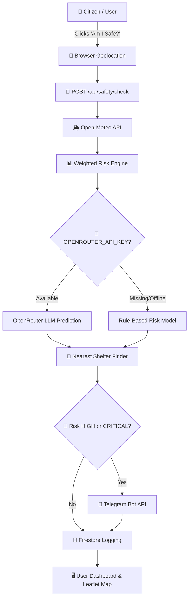

# 🛡️ FloodRakshak AI — Personal Disaster Safety Assistant

> **AI-powered real-time flood risk assessment, GPS-based safety checks, Open-Meteo weather intelligence, and instant Telegram emergency warnings.**

[](https://nextjs.org/)
[](https://www.typescriptlang.org/)
[](https://tailwindcss.com/)
[](https://firebase.google.com/)
[](https://open-meteo.com/)
[](https://telegram.org/)

---

## 🌟 Overview

**FloodRakshak AI** is a citizen-first personal disaster safety assistant engineered for rapid flood risk assessment and early warning dispatch. Built for high-stakes emergency situations, it allows any citizen to answer one critical question with a single tap: **“Am I Safe?”**

By combining live meteorological data from **Open-Meteo**, AI-assisted risk prediction via **OpenRouter**, interactive **Leaflet** geospatial mapping, and automated **Telegram Bot alerts**, FloodRakshak AI empowers citizens and emergency responders with immediate, actionable safety intelligence.

---

## ✨ Key Features

- 🛡️ **One-Tap "Am I Safe?" Safety Check**: Instantly queries user GPS coordinates and evaluates local flood risk.
- 🌦️ **Live Open-Meteo Weather Engine**: Fetches real-time rainfall, relative humidity, temperature, wind speed, and 6-hour precipitation forecasts.
- 🤖 **Dual-Engine Risk Scoring**:
  - **OpenRouter AI Engine**: Predicts flood risk level, explanation, and recommended actions using LLMs.
  - **Rule-Based Engine (Fallback)**: Weighted mathematical scoring guaranteeing zero-downtime during offline or hackathon demo scenarios.
- 🗺️ **Interactive Geospatial Map (Leaflet)**:
  - Real-time **User Location Marker** (📍).
  - Dynamic **Danger Zone Circles & Polygons** (🚨) rendered when risk level is HIGH or CRITICAL.
  - **Nearest Safe Evacuation Shelters** (🏥) with capacity metrics.
  - **Green Safe Evacuation Route** (🛤️) connecting user to shelter.
- 📲 **Instant Personal Telegram Warnings**: Dispatches emergency alert messages directly to the user's registered Telegram Chat ID when risk is elevated.
- 💬 **WhatsApp Click-to-Share Fallback**: Generates instant `https://wa.me/?text=` share links for community warning broadcasts.
- ⚡ **Instant Hackathon Demo Mode**: Bypasses authentication via `NEXT_PUBLIC_DEMO_MODE=true` for seamless judge demonstrations.

---

## 🏗️ Architecture Workflow



---

## 🛠️ Tech Stack

| Component | Technology |
|---|---|
| **Framework** | Next.js 16 (App Router, Turbopack) |
| **Language** | TypeScript |
| **Styling** | Tailwind CSS + Lucide Icons |
| **Database & Auth** | Firebase Authentication + Cloud Firestore + Firebase Admin SDK |
| **Weather API** | Open-Meteo Forecast API (No API key required) |
| **AI Risk Prediction** | OpenRouter AI API (Google Gemini 2.0 Flash / Fallback) |
| **Alert Channels** | Telegram Bot API (`node-telegram-bot-api` / HTTP) + WhatsApp Share Link |
| **Geospatial Mapping** | Leaflet + React-Leaflet |

---

## 📂 Repository Directory Structure

```text
Flood-gaurd-AI/
├── src/
│   ├── app/
│   │   ├── api/
│   │   │   ├── safety/check/     # Core "Am I Safe?" safety check endpoint
│   │   │   ├── weather/current/  # Open-Meteo weather endpoint
│   │   │   ├── notify/telegram/  # Telegram alert broadcaster
│   │   │   ├── notify/whatsapp-link/ # WhatsApp share link generator
│   │   │   ├── register/         # User registration handler
│   │   │   └── telegram/webhook/ # Telegram interactive webhook
│   │   ├── dashboard/            # Citizen dashboard & interactive map
│   │   ├── login/                # User authentication page
│   │   ├── register/             # User registration with Telegram Chat ID
│   │   ├── layout.tsx            # Global layout & metadata
│   │   └── page.tsx              # Landing page
│   ├── components/
│   │   ├── dashboard/
│   │   │   ├── MapComponent.tsx  # Leaflet map with danger zones & routes
│   │   │   └── Sidebar.tsx       # Navigation sidebar
│   │   └── SessionProvider.tsx   # Auth context & Demo Mode provider
│   ├── services/
│   │   ├── open-meteo.ts         # Open-Meteo weather service
│   │   ├── risk-engine.ts        # Weighted rule-based risk scoring
│   │   ├── openrouter.ts         # OpenRouter AI prediction service
│   │   └── telegram.ts           # Telegram message formatting & bot API
│   └── lib/
│       └── firebase/             # Client & Admin SDK configuration
├── .env.example                  # Environment variables template
├── next.config.ts                # Next.js configuration
├── package.json                  # Dependencies and scripts
├── tsconfig.json                 # TypeScript compiler options
└── README.md                     # Project documentation
```

---

## 🚀 Quick Start Guide

### Prerequisites
- Node.js 18.x or higher
- npm / yarn / pnpm

### 1. Clone Repository
```bash
git clone https://github.com/sowmi21062006/Flood-gaurd-AI.git
cd Flood-gaurd-AI
```

### 2. Install Dependencies
```bash
npm install
```

### 3. Configure Environment Variables
Copy `.env.example` to `.env.local`:
```bash
cp .env.example .env.local
```

Example Configuration:
```env
NEXT_PUBLIC_DEMO_MODE=true

OPENROUTER_API_KEY=your_openrouter_api_key_optional
TELEGRAM_BOT_TOKEN=your_telegram_bot_token_optional

NEXT_PUBLIC_FIREBASE_API_KEY=your_firebase_key
NEXT_PUBLIC_FIREBASE_AUTH_DOMAIN=your_project.firebaseapp.com
NEXT_PUBLIC_FIREBASE_PROJECT_ID=your_project_id
```

> **Note**: Setting `NEXT_PUBLIC_DEMO_MODE=true` enables instant single-click dashboard testing without needing active Firebase or OpenRouter credentials.

### 4. Run Development Server
```bash
npm run dev
```
Open [http://localhost:3000](http://localhost:3000) in your browser.

### 5. Build for Production
```bash
npm run build
```

---

## 📡 API Endpoints Reference

### `POST /api/safety/check`
Executes full personal safety check workflow.

**Request Body:**
```json
{
  "lat": 13.0827,
  "lng": 80.2707,
  "userId": "demo-user",
  "phoneNumber": "+919999999999",
  "telegramChatId": "123456789",
  "district": "Chennai",
  "language": "english"
}
```

**Response Sample:**
```json
{
  "success": true,
  "riskScore": 78,
  "riskLevel": "HIGH",
  "isInDangerZone": true,
  "explanation": "High flood risk detected due to heavy rainfall (18mm) and 72mm predicted over the next 6 hours.",
  "recommendedAction": "Prepare to evacuate. Move towards Government Higher Secondary School - Shelter.",
  "userLocation": { "lat": 13.0827, "lng": 80.2707 },
  "dangerZone": {
    "center": { "lat": 13.0827, "lng": 80.2707 },
    "radiusMeters": 2000,
    "polygon": [[13.0977, 80.2557], [13.0977, 80.2857], [13.0677, 80.2857], [13.0677, 80.2557]]
  },
  "nearestShelter": {
    "name": "Government Higher Secondary School - Shelter",
    "lat": 13.09,
    "lng": 80.275,
    "capacity": 500
  },
  "safeRoute": [[13.0827, 80.2707], [13.09, 80.275]],
  "telegram": {
    "attempted": true,
    "sent": true,
    "status": "Alert sent successfully via Telegram"
  },
  "message": "🟠 High flood risk! Prepare to evacuate to the nearest shelter."
}
```

---

## 🌍 UN Sustainable Development Goals (SDGs) Alignment

- 🏙️ **SDG 11 — Sustainable Cities and Communities**: Target 11.5 (Significantly reduce the number of deaths and people affected by disasters).
- 🌍 **SDG 13 — Climate Action**: Target 13.1 (Strengthen resilience and adaptive capacity to climate-related hazards and natural disasters).

---

## 📄 License

Distributed under the MIT License. See `LICENSE` for more details.
